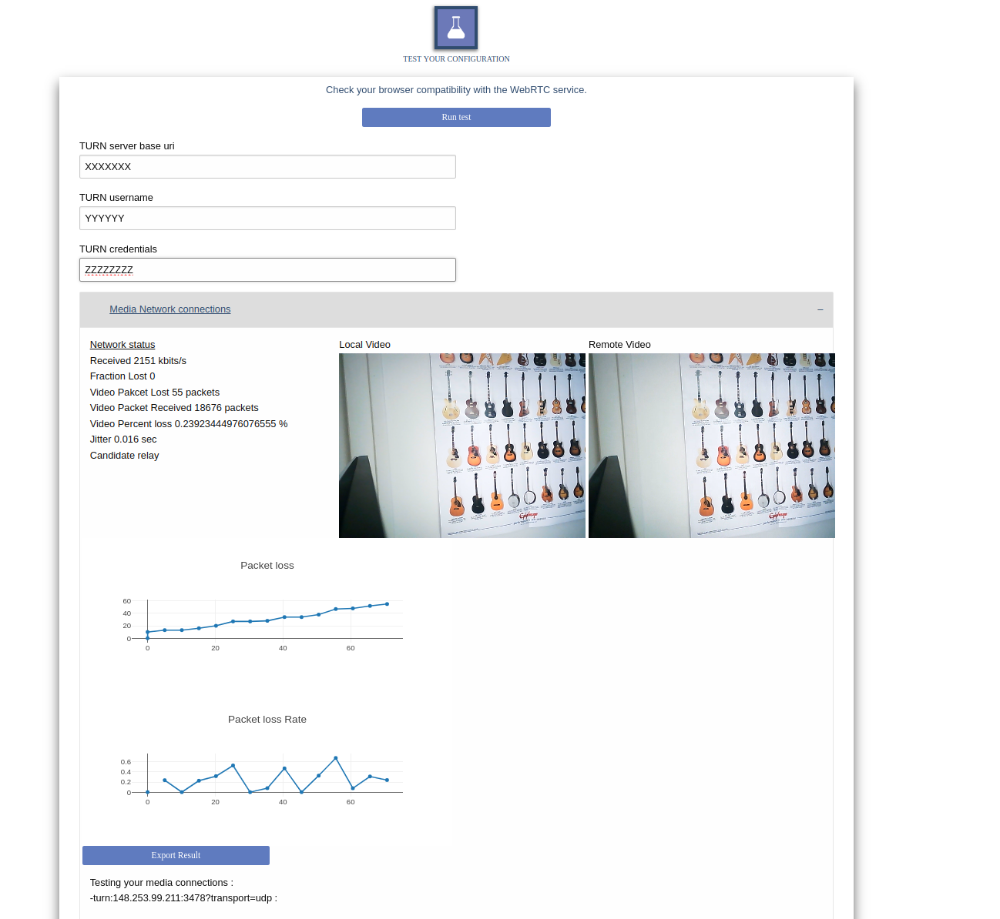

# Turn_Test_Page

A simple WebRTC page that start an echo test with the selected TURN server.


## Motivation

Test the configuration and the stability of a Turn server and your network to this server.



## You need a working TURNserver with lt auth credential

Install a turn server and then configure lt credential.

For exemple in Ubuntu distribution : 

```
apt install coturn
```

Add this following line in /etc/turn.conf with your own TURN_USER and TURN_PASSWORD: 

```
lt-cred-mech
user=[TURN_USER]:[TURN_PASSWORD]
realm=test
listening-ip=0.0.0.0
syslog
verbose 
```

If you're deploying the turn server behind a NAT add this following line with your PUBLIC_IP and PRIVATE_IP : 

```
external-ip=[PUBLIC_IP]/[PRIVATE_IP]
```


## Usage

Set you default TURN configuration in config/config.js and put the src file in a webserver.

```
> cp config/config_ref.js config/config.js
> vi config/config.js
```

You can run the provided Nginx server docker if you don't have a webserver somewhere. 

```
docker build -t turn-test-page .
docker run -it --rm -d -p 8080:80 --name webTurn turn-test-page
```

Open http://127.0.0.1:8080/ and clic "RUN test".
